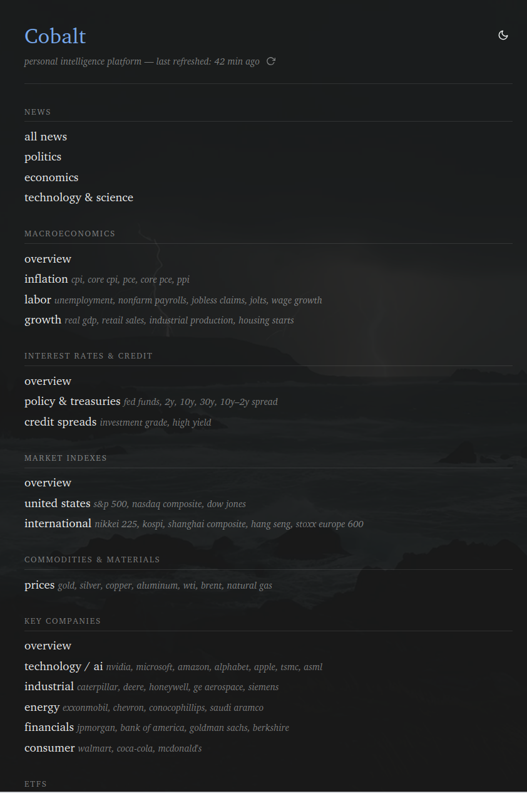
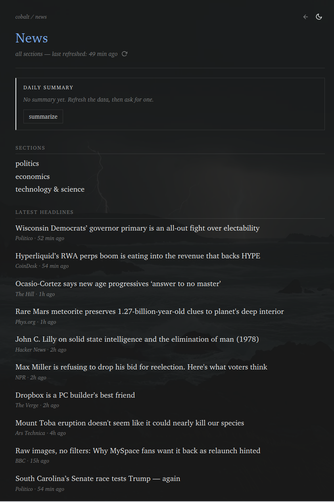
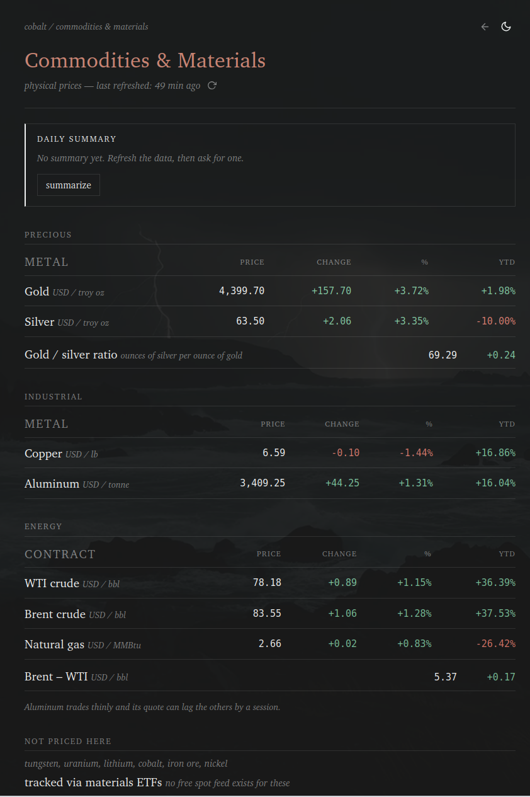
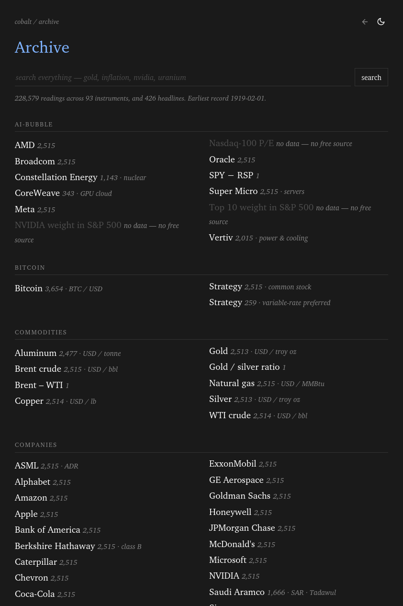
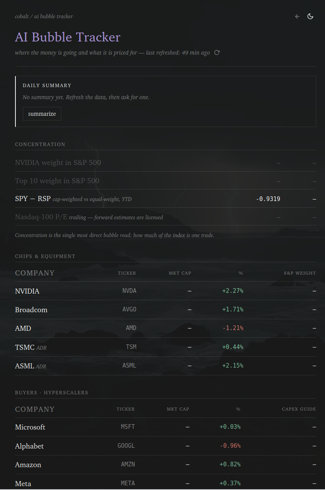

# Cobalt

An open-source, market intelligence platform that runs entirely on your own hardware.

Cobalt tracks macroeconomics, interest rates, market indexes, commodities, key
companies and ETFs, pulls the news around them, and uses a local language model
to explain what changed. No accounts, no subscription, and nothing is sent
anywhere.

## Why

Most of this information is already free. The Federal Reserve publishes its own
data, Yahoo carries prices, and every news outlet has an RSS feed. What is
normally sold is the convenience of having it in one place, and the price of
that convenience is a monthly fee, an account, and your reading habits as a
data product.

Cobalt is the same information assembled locally. A few rules shaped every
decision in it:

**Only free, public sources.** If something cannot be fetched without a paid
subscription, it does not go in.

**Data is dated, and never overwritten.** Economic series get revised. Every
observation is stored against the day it belongs to, so a revision stays
visible instead of quietly replacing history. Prices older than their cadence
allows are marked stale rather than passing for current.

**Headlines link out.** Only a headline, a link and a timestamp are stored,
never article text. Every story goes back to whoever wrote it.

**The model only sees what you see.** Summaries are built from the figures and
headlines already on the page, with instructions not to introduce anything
else. It runs on your GPU, so no prompt leaves the machine.

---

## Contents

- [Screenshots](#screenshots)
- [What it tracks](#what-it-tracks)
- [The archive](#the-archive)
- [Running it](#running-it)
  - [Behind a VPN](#behind-a-vpn)
- [Adding summaries](#adding-summaries)
  - [Using an NVIDIA GPU](#using-an-nvidia-gpu)
  - [Configuring the model](#configuring-the-model)
- [How it works](#how-it-works)
  - [The catalog](#the-catalog)
  - [Ingest](#ingest)
  - [Cleaning](#cleaning)
  - [The document layer](#the-document-layer)
  - [Rendering](#rendering)
- [Data sources](#data-sources)
  - [Backfilling](#backfilling)
- [Project layout](#project-layout)
- [Development](#development)
- [Troubleshooting](#troubleshooting)
- [Licence](#licence)

---

## Screenshots

**The index.** Every section, and what each one covers.



**News.** One combined feed plus a page per topic, balanced so no single
publisher can crowd out the rest. Every headline links to its source.



**Commodities.** Prices with their units, the day's move, and year to date.
Derived rows like the gold/silver ratio are computed locally. What cannot be
priced for free is listed as such rather than guessed at.



**The archive.** Everything the store has kept, browsable by section or
searchable. Counts are shown up front, and the handful of measures with no free
source are greyed rather than linking to an empty table.



**AI bubble tracker.** Built around concentration rather than price, and
organised as the money flows: chips, then the hyperscalers buying them, then
the buildout and the power it needs. Empty rows are measures with no free
source, left visible instead of filled in.



---

## What it tracks

| Section | Contents |
| --- | --- |
| News | Politics, economics, technology and science |
| Macroeconomics | Inflation, labour, growth |
| Interest rates & credit | Policy rate, 2/10/30-year treasuries, the curve, credit spreads |
| Market indexes | US and international |
| Commodities | Precious, industrial and energy |
| Key companies | Tech/AI, industrial, energy, financials, consumer |
| ETFs | Broad market, international, materials |
| AI bubble tracker | Concentration, the AI supply chain, capex, buildout and power |
| Bitcoin | Price, and Strategy's common and preferred |

Every price page has a chart with 1D, 1W, 1M, YTD, 1Y, 5Y and 10Y ranges, and a
block of headlines matched to what that page tracks.

---

## The archive

Every reading is kept. `/sections/archive` is the way back into them.

**Browse** by section, with an entry count against each instrument, so you can
see at a glance what has depth and what does not. **Search** matches
instruments by name, ticker, key or tag, and headlines by title — one box over
both. **Open one** and you get its full history, newest first and paginated,
with a chart, its tags and units, and any headlines that mention it.

It is rendered server-side from a plain GET form. That keeps every view a real
URL: `/sections/archive?key=CPIAUCSL&offset=900` is a link you can bookmark or
send to someone, which a JavaScript search box would have cost for no benefit.

Prices and economic series are stored differently — daily closes in one table,
dated readings with their own change in another — but the archive shows one
kind of row either way, computing the change for prices as it reads them.

---

## Running it

You need [Docker](https://docs.docker.com/get-docker/). Everything else —
Python, the database, the web server — is inside the image.

```sh
git clone https://github.com/RuariW12/cobalt-intelligence
cd cobalt-intelligence
./cobalt-start.sh
```

Open <http://localhost:5173> and press the refresh icon next to the title. The
first ingest takes about thirty seconds.

```sh
./cobalt-start.sh              # app only
./cobalt-start.sh --llm        # + the local model
./cobalt-start.sh --gpu --llm  # + the model in a container on an NVIDIA GPU
./cobalt-stop.sh               # stop; your data is kept
./cobalt-stop.sh --wipe        # stop and delete the database and model weights
```

**Economic data needs a free key.** Register at
[fredaccount.stlouisfed.org](https://fredaccount.stlouisfed.org), then:

```sh
cp .env.example .env
# paste the key after FRED_API_KEY=
```

Without it, prices, ETFs and news still work; the macro and interest-rate pages
stay blank.

Other settings in `.env`: `COBALT_PORT` if 5173 is taken, and `TZ` so "today"
means your day rather than UTC.

**On Windows**, install Docker Desktop, let it enable WSL2, and run the commands
from a WSL terminal rather than PowerShell.

### Behind a VPN

A kill switch that drops non-tunnel traffic breaks Docker's bridge network in
two places at once: the build cannot reach PyPI, and connections to the app die
even though the container reports healthy. `./cobalt-start.sh` detects this and
switches to host networking on its own.

The cleaner fix is to allow local network sharing in your VPN client. On Mullvad
that is `mullvad lan set allow`.

---

## Adding summaries

The model runs on the host rather than in a container, because that is the
better trade with an NVIDIA card: Ollama talks to the driver directly, so no
container toolkit is needed, and the weights are not downloaded twice.

```sh
curl -fsSL https://ollama.com/install.sh | sh   # or download for macOS/Windows
ollama pull qwen3.5:9b
./cobalt-start.sh --llm
```

The script builds a model named `cobalt` from `config/ollama/Modelfile` and
prints where it landed:

```
cobalt is up -> http://localhost:5173
model        -> cobalt on http://127.0.0.1:11434
processor    -> 100% GPU
```

If that last line does not say GPU, the model is on the CPU and summaries take a
minute instead of a few seconds.

Sizing for a 12 GB card: an 8–9B model at Q4 is about 5 GB and fits with room
for a 16k context. A 14B is about 9 GB and fits with
`OLLAMA_KV_CACHE_TYPE=q8_0`. Anything at 24B or above spills into system RAM and
crawls. Summarising is prefill-heavy — long input, short output — and CPU
offload hurts prefill far more than generation, so staying inside VRAM matters
more than parameter count.

### Using an NVIDIA GPU

Only needed if you run Ollama **inside** a container with `--container-ollama`.
With the default host-native Ollama the GPU already works.

```sh
sudo apt install -y nvidia-container-toolkit
sudo nvidia-ctk runtime configure --runtime=docker
sudo systemctl restart docker
docker run --rm --gpus all nvidia/cuda:12.4.0-base-ubuntu22.04 nvidia-smi
```

Docker Desktop cannot pass through Apple Silicon GPUs, so on a Mac Ollama has to
run natively — which is the default here anyway.

### Configuring the model

`config/ollama/Modelfile` holds the context window, sampling parameters and
system prompt, version-controlled in the repo. Two settings matter more than the
rest:

- **`num_ctx 16384`.** Ollama defaults to 4096 and truncates past it silently. A
  day of headlines exceeds that, and the result looks like a working summary of
  partial data rather than an error.
- **`"think": false`** on every request. Qwen is a reasoning model and left alone
  spends thousands of tokens thinking before answering. Measured on the same
  prompt: 52.7s and 3220 tokens with thinking, 2.4s and 124 tokens without — and
  the shorter run gave the better summary. This one cannot go in the Modelfile,
  so it is set in the request body.

---

## How it works

```
app/catalog.py ──┬─► instruments + tags ──────► instrument, tag
                 │
                 └─► what each section needs ─► symbols[] , series[]
                                                   │        │
                                         Yahoo chart      FRED      RSS feeds
                                                   │        │          │
                                                   └────────┼──────────┘
                                                            ▼
                                                     store/clean.py
                                       validate · derive change · flag suspect
                                                            ▼
                                       ┌────────────────────┼───────────────┐
                                  observation            history         article
                                 (append-only)       (daily closes)    (url unique)
                                                            ▼
                                                    store/documents.py
                                            one dated, tagged sentence per fact
                                                            ▼
                                                        document
                                                       │        │
                                          pages ◄──────┘        └──────► the model
```

### The catalog

`app/catalog.py` is the single source of truth. It describes every page as an
ordered list of panels, and every data row carries the identifier that fills it:
`series` for FRED, `symbol` for Yahoo, `derived` for something computed here.

The templates walk it to lay out a page. The ETL walks the same file to learn
what to fetch. They cannot disagree, because a page and its ingest are one
declaration. Adding a row is all it takes to start tracking something.

A guard runs at import: a row that prints a ticker must fetch that same ticker.
It caught a real bug where the VOO row fetched `^GSPC`, so the ETF page showed
the S&P 500 index level in place of the fund price — plausible-looking, wrong,
and silent.

### Ingest

`etl/run.py` reads the catalog for a section, fetches what it needs, and never
lets one failure take down the run. Prices come from Yahoo's chart endpoint,
which serves quotes with no key, cookie or crumb — which is why this needs
neither `yfinance` nor pandas. That same response carries a year of daily
closes, so the charts cost no extra requests.

### Cleaning

Every source funnels through `store/clean.py`, so they all get the same
guarantees: floats coerced, NaN rejected, `change` derived from the prices
rather than trusted, percent change only for price-like assets, and implausible
moves flagged rather than dropped. A suspicious number you can see beats a gap
you cannot explain.

### The document layer

A table row is a poor unit of retrieval — it means nothing without its header,
its units and its date. So every observation also becomes one self-contained
sentence:

```
2026-08-07 — Gold (GC=F), commodities/precious: 4,399.70 USD / troy oz,
+157.70 (+3.72%) versus the previous session; +1.98% year to date.
tags: commodities future inflation-hedge precious precious-metals safe-haven
```

Headlines become documents the same way. That is what the model reads, and what
an embedding index would index later. Tags are structural (section, category),
inferred (asset class) and thematic (`ai-supply-chain`, `recession-signal`), so
retrieval can cross sections.

### Rendering

`app/render.py` fills catalog rows from the store. A row with no observation
keeps its placeholder styling, so an un-ingested page looks deliberately empty
rather than broken. Summaries retrieve documents by section and tag, label them
as figures and headlines, and hand both to the model.

---

## Data sources

| Source | Provides | Key |
| --- | --- | --- |
| [FRED](https://fred.stlouisfed.org) | Inflation, labour, growth, treasuries, credit spreads | Free, required for these |
| [Yahoo Finance](https://finance.yahoo.com) | Equities, ETFs, indexes, futures, crypto, history | None |
| RSS | 13 publishers across politics, economics, tech and crypto | None |

FRED series are requested with the transform the page actually means. Asking for
CPI as a level and labelling it "year over year" would be wrong in the way that
is hardest to notice, so inflation series are fetched as `pc1`, monthly changes
as `pch`, and GDP as `pca`.

### Backfilling

A fresh install starts with today. To fill in the past:

```sh
docker compose -f docker/compose.yml run --rm etl --backfill
```

That pulls every FRED series to inception and ten years of daily closes for
every symbol — around 230,000 readings, a few minutes, mostly waiting on
Yahoo. Run it once. It is deliberately not part of a refresh: a treasury series
is sixteen thousand points and none of them will ever change.

`--since YYYY-MM-DD` limits how far back it goes.

Historical points are stored as observations but produce no documents. Writing
one per point would add tens of thousands of rows to the model's retrieval
surface, all stale by definition — the model wants the current reading, not CPI
from 1974.

Some things are tracked but cannot be priced for free, and are left blank rather
than guessed: tungsten, uranium, lithium, cobalt, iron ore and nickel. ISM PMI
was removed from FRED in 2016 over licensing. Forward P/E and index constituent
weights are paywalled.

---

## Project layout

```
cobalt-start.sh  cobalt-stop.sh    the supported way to run it
app/catalog.py                     every page, panel and row
app/main.py                        FastAPI: pages, /api/refresh, /api/summarize
app/render.py                      fills catalog rows from the store
app/templates/                     base.html + page.html render the catalog;
                                   archive.html is the stored-data browser
store/                             schema, cleaning, tagging, documents
etl/                               ingest and the source adapters
web/                               stylesheets and scripts
config/ollama/Modelfile            the model's context, sampling and prompt
docker/                            Dockerfile and compose files
context/                           design notes and the reasoning behind them
```

---

## Development

The app runs in Docker, so nothing needs installing to use it. To stop your
editor complaining about unresolved imports:

```sh
python3 -m venv .venv
.venv/bin/pip install -r requirements.lock
```

Installing from the lock rather than `requirements.txt` means the editor checks
against exactly the versions the container runs.

`web/` and `app/templates/` are bind-mounted, so stylesheets, scripts and
templates are live. Python code is baked into the image and needs a restart.

Assets are served with a version query string derived from their modification
time, so a CSS edit can never be masked by a cached copy.

### Reproducibility

`requirements.lock` pins every package including transitive dependencies.
Regenerate after editing `requirements.txt`:

```sh
docker compose -f docker/compose.yml build web
docker run --rm cobalt:latest pip freeze > requirements.lock
```

### Backup

```sh
docker run --rm -v cobalt_cobalt-data:/d -v "$PWD":/b alpine \
  tar czf /b/cobalt-data.tar.gz -C /d .
```

---

## Troubleshooting

**Port 5173 already in use.** Set `COBALT_PORT` in `.env`. The start script names
whatever is holding the port.

**Permission denied connecting to the Docker daemon** (Linux). Run
`sudo usermod -aG docker $USER`, then log out and back in.

**The build fails with a DNS error.** Usually a VPN kill switch — see
[Behind a VPN](#behind-a-vpn). Otherwise your daemon has no working DNS: add
`{"dns": ["1.1.1.1"]}` to `/etc/docker/daemon.json` and restart Docker.

**The container is healthy but the page will not load.** Same VPN cause. Run
`./cobalt-start.sh --vpn`.

**Macro and interest-rate pages are empty.** No `FRED_API_KEY`, or it was added
after the container started. Restart.

**Summarize says the model is unavailable.** Ollama is not running. Start it,
then use `./cobalt-start.sh --llm`.

**Summaries take a minute.** The model is on the CPU. Run `ollama ps` — the
processor column should read 100% GPU.

**Prices look out of date.** Markets were closed at the last refresh. Hover any
row for the date the figure belongs to; stale rows are greyed with a red tick.

---

## Licence

[MIT](LICENSE). Use it, change it, run your own.

Not investment advice. The data comes from third parties and can be wrong, late
or revised.
